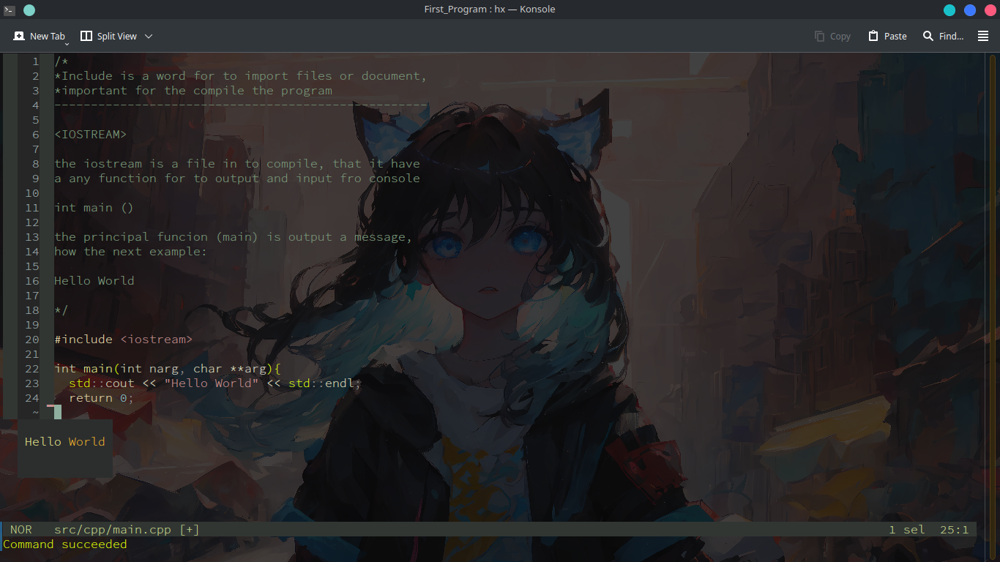

# LENGUAGE_C-
## Struct
### src
This *folder*, is the basic struct for me, that i going to use for my **PROJECT**.
So, in this space, You find folders for header, cpp file and other file to cpp project
### execute
It have a execute file, that this are file to execute the compile program.
### static
Yeah, it have file static, how example: pictures, music, other, I don't know other files that I goint to use
on the future.
## PROGRAMS
### First Program
1. You have to make a program, that it show a message in the console.
"""
  output >> Hello World
"""
2. **NOTE** ***::*** the code is in the folder with de nade First Program

